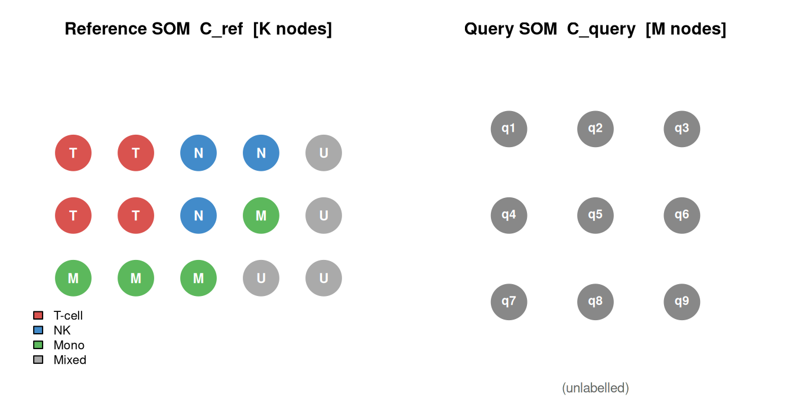
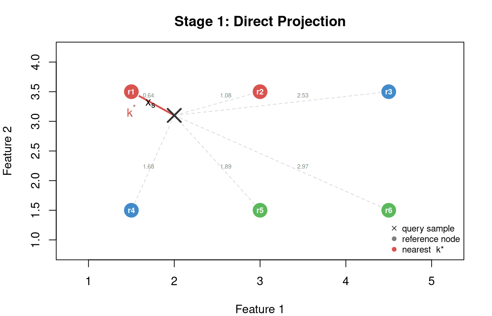
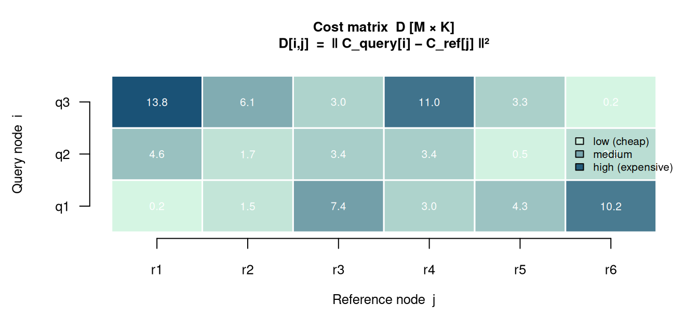
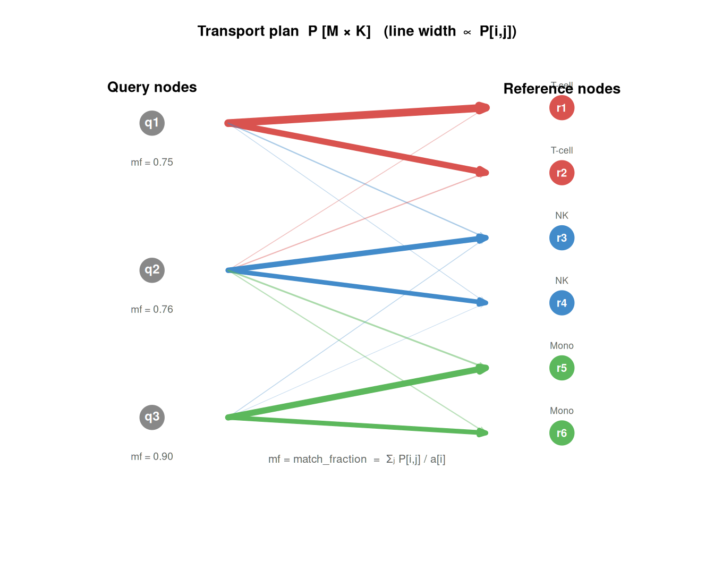
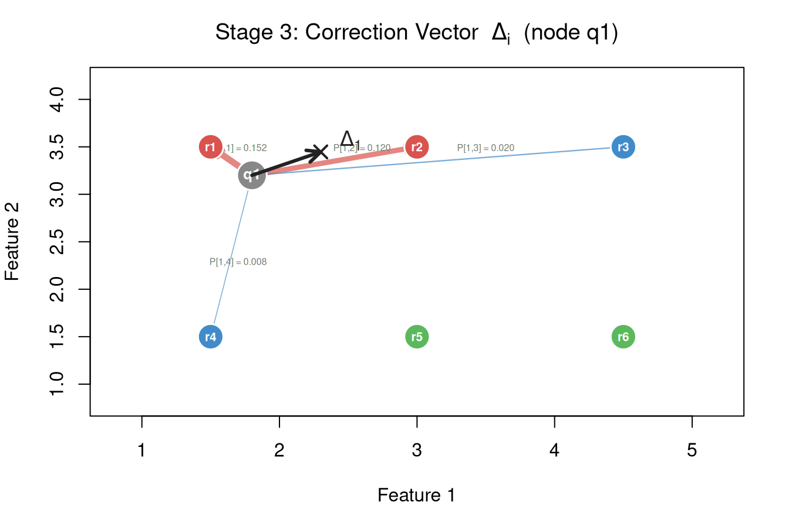
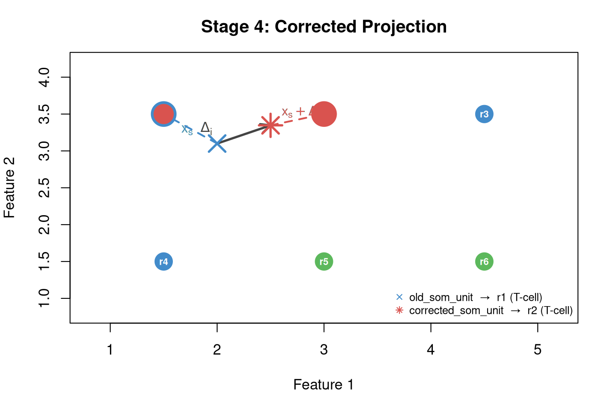
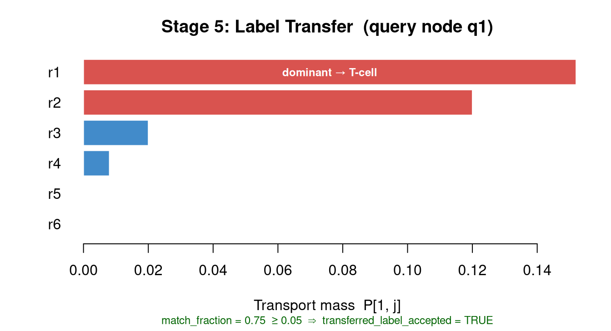

# Algorithm and interpretation

`somalign` aligns a query SOM to a fixed reference SOM using
codebook-level KL-unbalanced entropic optimal transport. This page walks
through each stage of the pipeline, explaining how direct projection,
the OT correspondence, correction vectors, and label transfer each
contribute to the output columns.

The OT stage uses the internal pure-R Sinkhorn solver. There is no
external transport backend to configure. Direct projection is always
computed first and is the primary result; the OT-derived columns are
auxiliary.

## Pipeline overview

`{r overview, echo = FALSE, fig.height = 6, eval = requireNamespace("DiagrammeR", quietly = TRUE)} DiagrammeR::mermaid(" graph TD OD[Old data] --> NS[z-score normalise] ND[New data] --> RT[transform: ref mu sigma] NS --> RS[Reference SOM<br/>C_ref K x p] RT --> QS[Query SOM<br/>C_query M x p] RS --> S1[Stage 1: Direct Projection] QS --> S1 RS --> S2[Stage 2: OT on Codebooks] QS --> S2 S2 --> TP[Transport plan P<br/>M x K] TP --> S3[Stage 3: Correction Vectors] RS --> S3 S3 --> S4[Stage 4: Corrected Projection] TP --> S5[Stage 5: Label Transfer] S1 --> PR[old_som_unit<br/>old_som_label<br/>final_status] S4 --> AX[corrected_som_unit<br/>correction_norm<br/>transferred_label] S5 --> AX style PR fill:#d4edda,stroke:#28a745,color:#155724 style AX fill:#cce5ff,stroke:#004085,color:#004085 style S1 fill:#fff3cd,stroke:#856404 style S2 fill:#fff3cd,stroke:#856404 style S3 fill:#fff3cd,stroke:#856404 style S4 fill:#fff3cd,stroke:#856404 style S5 fill:#fff3cd,stroke:#856404 ")`

------------------------------------------------------------------------

## Stage 0 — Training both SOMs

The reference SOM is trained on labelled old data after z-score
normalisation with the old-data mean $`\mu`$ and standard deviation
$`\sigma`$. The query SOM must be trained on new data transformed with
those same reference parameters — not new-data z-scores — so that both
codebooks lie in the same feature coordinate system.



------------------------------------------------------------------------

## Stage 1 — Direct projection (primary result)

Every new sample $`x_s`$ is assigned to its nearest reference node by
Euclidean distance:
``` math
k^* = \arg\min_k \|x_s - C_{\text{ref},k}\|
```

No transport is involved. The assignment is deterministic given the
reference codebook and is the result to use for downstream analysis.



**Output:** `old_som_unit = k*`, `old_som_distance`,
`old_som_distance_threshold`, `outside_reference_distance`,
`final_status`, `old_som_label`, `old_som_label_confidence`.

------------------------------------------------------------------------

## Stage 2 — OT on codebooks

Transport is solved once on the **codebooks** ($`M`$ query nodes × $`K`$
reference nodes), not on individual samples, keeping the problem
dimensionality independent of sample count.

### 2a — Cost matrix



### 2b — OT objective

The transport plan $`P`$ minimises:

``` math
\sum_{ij} P_{ij} D_{ij}
  + \varepsilon \cdot \mathrm{KL}(P \,\|\, \mathbf{a}\otimes\mathbf{b})
  + \rho_q \cdot \mathrm{KL}(P\mathbf{1} \,\|\, \mathbf{a})
  + \rho_r \cdot \mathrm{KL}(P^\top\!\mathbf{1} \,\|\, \mathbf{b})
```

where $`\mathbf{a}`$ and $`\mathbf{b}`$ are the query and reference node
masses. The KL marginal penalties relax the balance constraint: mass can
be destroyed rather than transported, so a query node with no good
reference counterpart routes only a small fraction of its mass rather
than forcing an artificial match. The plan is found by the internal
pure-R Sinkhorn scaling implementation.

### 2c — Transport plan



`match_fraction` near 1 means the node transported most of its mass to
reference nodes; near 0 means little overlap with any reference
population. Label transfer is rejected for low-match nodes.

------------------------------------------------------------------------

## Stage 3 — Correction vectors

For each query node $`i`$ the OT plan defines a weighted mean
displacement toward its matched reference nodes:

``` math
\Delta_i = \frac{\displaystyle\sum_j P_{ij}\,(C_{\text{ref},j} - C_{\text{query},i})}
                  {\displaystyle\sum_j P_{ij}}
```



A small $`\|\Delta_i\|`$ means the query node sits close to its matched
reference positions. A large value indicates a systematic offset —
potentially a batch effect or a true population shift — and is worth
examining before accepting the corrected projection.

------------------------------------------------------------------------

## Stage 4 — Corrected projection (auxiliary)

Every sample in query node $`i`$ is shifted by the same $`\Delta_i`$ and
re-projected:

``` math
\text{corrected\_som\_unit}_s = \arg\min_k \|(x_s + \Delta_i) - C_{\text{ref},k}\|
```



Both assignments are reported in the results table. `old_som_unit`
(blue) is the primary result; `corrected_som_unit` (red),
`corrected_som_distance`, and `corrected_outside_reference_distance` are
intended for visualisation and triage, not as replacement assignments.

------------------------------------------------------------------------

## Stage 5 — Label transfer (auxiliary)

For each query node $`i`$, the reference node with the highest
transported mass in row $`P[i, \cdot]`$ is identified as the dominant
match, and its label is transferred when both acceptance thresholds are
passed.



Transfer is rejected at two gates: `match_fraction < 0.05` (node has no
meaningful reference overlap) and `transferred_label_confidence < 0.60`
(the dominant reference node is too mixed to assign a clean label).

------------------------------------------------------------------------

## Limitations of the OT correction

The OT-derived columns are auxiliary. Three structural limitations
govern when they should and should not be trusted.

### Barycentric contraction (F1)

The correction target for node $`i`$ is the transport-weighted mean of
matched reference codebook vectors:

``` math
\hat{C}_i = \frac{\sum_j P_{ij}\,C_{\text{ref},j}}{\sum_j P_{ij}}
```

This is a **conditional mean**, so the corrected positions always lie
inside the convex hull of the reference codebook. Two consequences
follow. First, variance shrinks: query nodes that genuinely sit near the
periphery of a reference cluster will be pulled inward. Second, dense
reference regions attract mass — if the reference has one very large
T-cell cluster and one small NK cluster, even a predominantly NK query
node will have its correction vector biased toward the T-cell centroid.
Contraction grows as `epsilon` increases, because a larger entropic
penalty spreads each transport row $`P[i,
\cdot]`$ across more reference nodes. Interpret `corrected_som_unit`
with `correction_norm`: a large shift ($`\|\Delta_i\|`$) in a
high-epsilon fit is the most suspect combination.

### Unpaired OT (F2)

OT operates on **node mass distributions**, not on individual samples.
If the query batch consists of literally remeasured biological units
(the same cells or patients measured again), that ground-truth
sample-level correspondence is available but unused here. Anchor-based
methods such as CytoNorm exploit exactly this pairing, using anchor
controls measured in both old and new batches to identify the batch map
with minimal ambiguity. `somalign` is designed for the common case where
no such anchors exist: only the phenotypic structure of the populations
(encoded in the codebooks) is shared. If you do have remeasured anchor
controls, incorporate them at the reference-building stage rather than
relying on the OT correction.

### Uncalibrated novelty score (F3)

`match_fraction` (and the derived label-transfer gate) reflects the
$`\varepsilon`$/$`\rho`$ regime as much as any biological novelty. A low
`match_fraction` means little query mass reached reference nodes, but
that can happen because (a) the query contains a genuinely novel
population, or (b) `rho_query` is small, (c) `epsilon` is large, or (d)
the query SOM topology differs from the reference. There is no null
model calibrating how much destroyed mass constitutes evidence of
novelty. Use
[`somalign_sensitivity_grid()`](https://mdmanurung.github.io/somalign/reference/somalign_sensitivity_grid.md)
to assess whether low-match nodes are stable across
$`\varepsilon`$/$`\rho`$ values before interpreting them as novel
populations.

------------------------------------------------------------------------

## Output columns

Direct projection columns are the primary result. OT-derived columns are
auxiliary — they should always be read alongside the direct assignment
and the
[`somalign_diagnostics()`](https://mdmanurung.github.io/somalign/reference/somalign_diagnostics.md)
output.

| Column | Stage | Purpose |
|----|----|----|
| `sample_id` | 0 | Query sample identifier |
| `query_som_unit` | 0 | Query SOM node containing the sample |
| `old_som_unit` | 1 | Primary node assignment |
| `old_som_distance` | 1 | Distance to that node |
| `old_som_distance_threshold` | 1 | Direct distance threshold |
| `outside_reference_distance` | 1 | Novelty flag |
| `final_status` | 1 | inside / outside / unknown |
| `old_som_label` | 1 | Primary label |
| `old_som_label_confidence` | 1 | Label purity at node |
| `corrected_som_unit` | 4 | OT-corrected assignment |
| `corrected_som_distance` | 4 | Distance after applying the node correction |
| `corrected_som_distance_threshold` | 4 | Corrected distance threshold |
| `corrected_outside_reference_distance` | 4 | Novelty flag after correction |
| `correction_norm` | 3/4 | Shift magnitude $`\|\Delta_i\|`$ |
| `transferred_label` | 5 | OT-derived label |
| `transferred_label_confidence` | 5 | Purity at dominant ref node |
| `transferred_label_accepted` | 5 | Gate result (TRUE / FALSE) |

OT runs once on the $`M \times K`$ codebook matrix. The per-sample cost
is an $`O(n \cdot K)`$ nearest-node search, performed in configurable
chunks by
[`somalign_fit()`](https://mdmanurung.github.io/somalign/reference/somalign_fit.md)
to keep memory use predictable.

## Session info

    #> R version 4.6.1 (2026-06-24)
    #> Platform: x86_64-pc-linux-gnu
    #> Running under: Ubuntu 24.04.4 LTS
    #> 
    #> Matrix products: default
    #> BLAS:   /usr/lib/x86_64-linux-gnu/openblas-pthread/libblas.so.3 
    #> LAPACK: /usr/lib/x86_64-linux-gnu/openblas-pthread/libopenblasp-r0.3.26.so;  LAPACK version 3.12.0
    #> 
    #> locale:
    #>  [1] LC_CTYPE=C.UTF-8       LC_NUMERIC=C           LC_TIME=C.UTF-8       
    #>  [4] LC_COLLATE=C.UTF-8     LC_MONETARY=C.UTF-8    LC_MESSAGES=C.UTF-8   
    #>  [7] LC_PAPER=C.UTF-8       LC_NAME=C              LC_ADDRESS=C          
    #> [10] LC_TELEPHONE=C         LC_MEASUREMENT=C.UTF-8 LC_IDENTIFICATION=C   
    #> 
    #> time zone: UTC
    #> tzcode source: system (glibc)
    #> 
    #> attached base packages:
    #> [1] stats     graphics  grDevices utils     datasets  methods   base     
    #> 
    #> other attached packages:
    #> [1] BiocStyle_2.40.0
    #> 
    #> loaded via a namespace (and not attached):
    #>  [1] digest_0.6.39       desc_1.4.3          R6_2.6.1           
    #>  [4] bookdown_0.47       fastmap_1.2.0       xfun_0.60          
    #>  [7] cachem_1.1.0        knitr_1.51          htmltools_0.5.9    
    #> [10] rmarkdown_2.31      lifecycle_1.0.5     cli_3.6.6          
    #> [13] sass_0.4.10         pkgdown_2.2.1       jquerylib_0.1.4    
    #> [16] compiler_4.6.1      tools_4.6.1         bslib_0.11.0       
    #> [19] evaluate_1.0.5      yaml_2.3.12         BiocManager_1.30.27
    #> [22] otel_0.2.0          jsonlite_2.0.0      rlang_1.3.0        
    #> [25] fs_2.1.0            htmlwidgets_1.6.4
