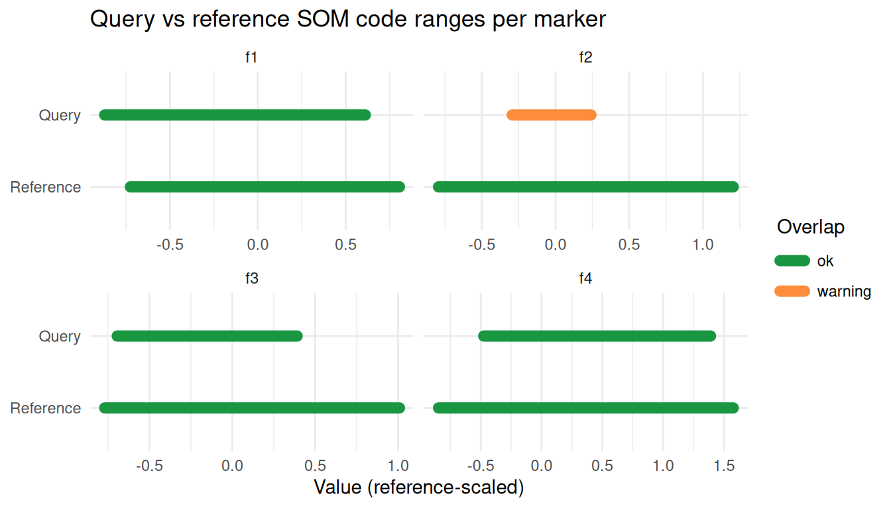
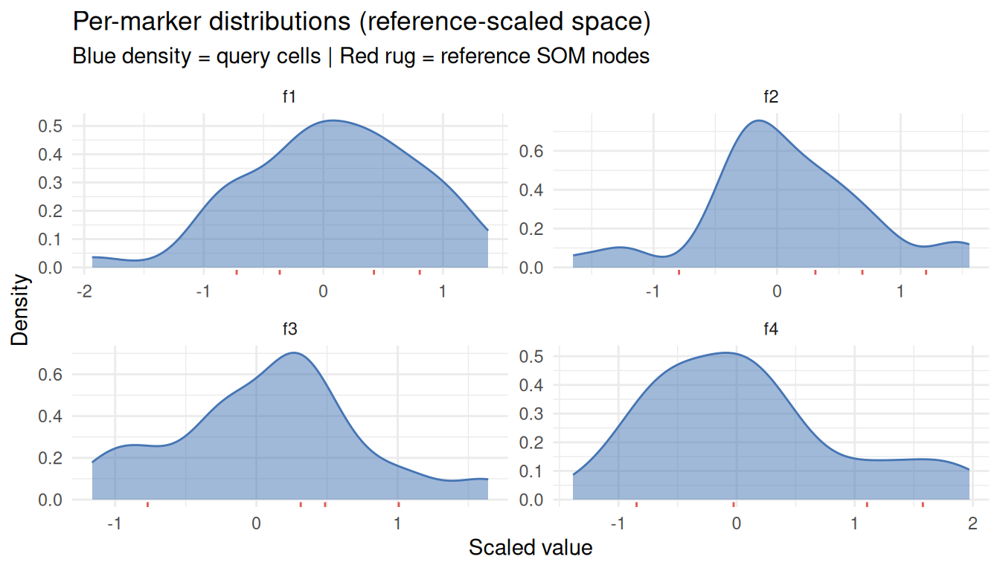
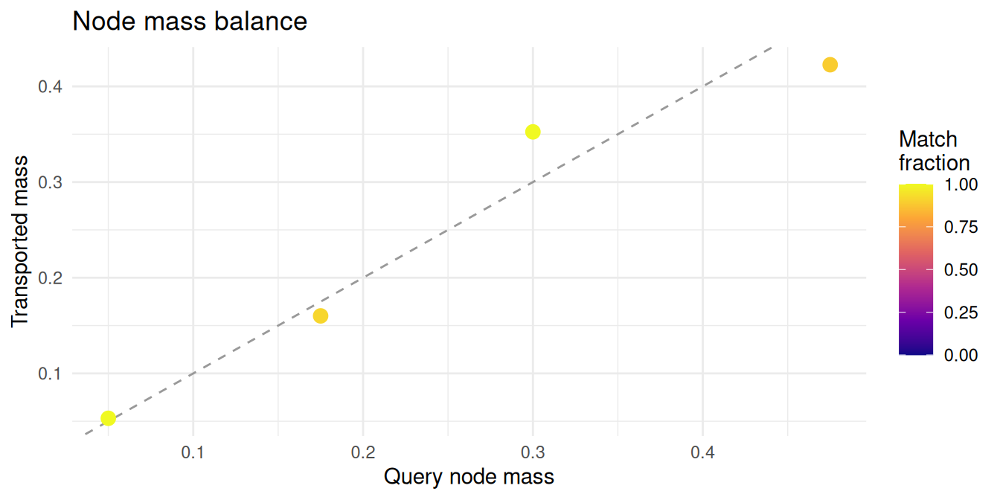
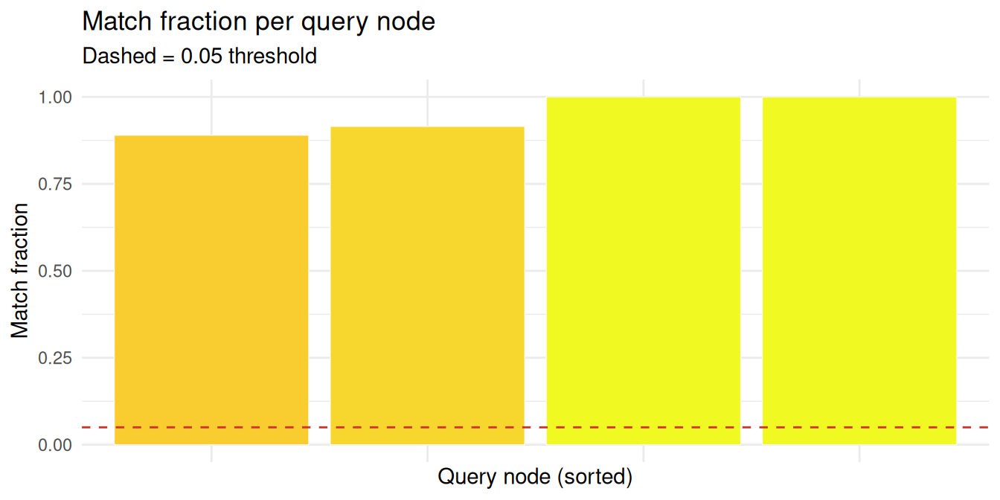
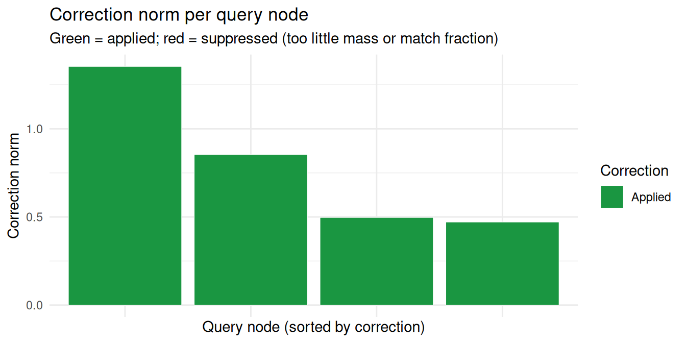
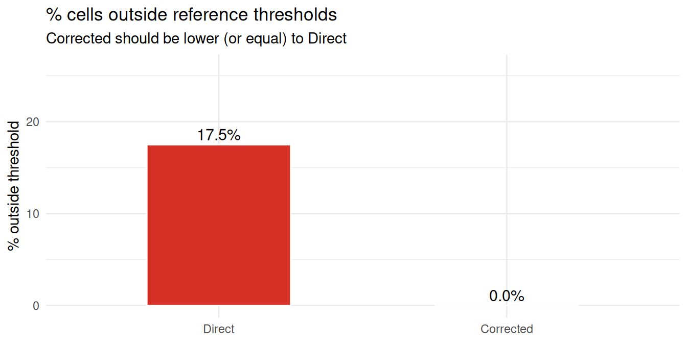
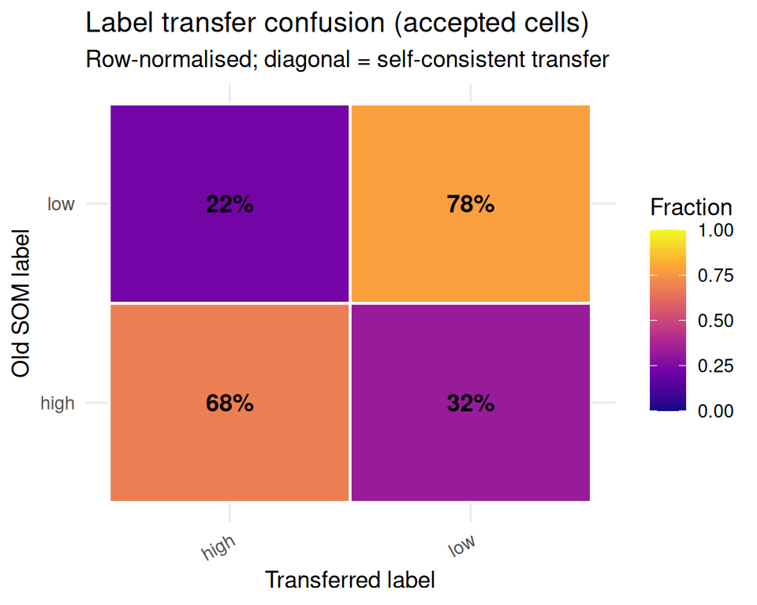

# Quick start

`somalign` aligns a query self-organising map to a fixed reference SOM
using codebook-level unbalanced entropic optimal transport. The example
below trains a reference SOM on labelled old samples, then projects a
shifted query dataset into that reference.

## Quick start

``` r

library(kohonen)
library(somalign)

set.seed(1)
old <- rbind(
  matrix(rnorm(80, mean = -1), ncol = 4),
  matrix(rnorm(80, mean = 1), ncol = 4)
)
colnames(old) <- paste0("f", seq_len(ncol(old)))
labels <- rep(c("low", "high"), each = 20)

reference <- somalign_train_reference(
  old,
  labels = labels,
  grid = kohonen::somgrid(2, 2, "hexagonal"),
  rlen = 5
)

query <- old + 0.2
query_obj <- somalign_query(
  query,
  reference,
  grid = kohonen::somgrid(2, 2, "hexagonal"),
  rlen = 5
)
#> somalign_reference_from_som: SOM has no second code layer; label transfer will be disabled.

fit <- somalign_fit(query_obj, reference)
#> somalign_fit: 2 query node(s) have match_mass_ratio > 1 (max 1.17); this is expected in unbalanced OT. See diagnostics$ot$match_mass_ratio for details.
results <- somalign_results(fit)
results_with_meta <- somalign_results(
  fit,
  data = data.frame(batch = rep("query_1", nrow(query)))
)
```

## Current API surface

The user-facing workflow is built around a small set of exported
functions:

- Build a reference with
  [`somalign_train_reference()`](https://mdmanurung.github.io/somalign/reference/somalign_train_reference.md),
  or wrap saved artifacts with
  [`somalign_reference()`](https://mdmanurung.github.io/somalign/reference/somalign_reference.md)
  /
  [`somalign_reference_from_nodes()`](https://mdmanurung.github.io/somalign/reference/somalign_reference_from_nodes.md).
- Prepare query data with
  [`somalign_query()`](https://mdmanurung.github.io/somalign/reference/somalign_query.md).
  Query samples are always scaled with the reference center and scale.
- Align query and reference SOM nodes with
  [`somalign_fit()`](https://mdmanurung.github.io/somalign/reference/somalign_fit.md).
  The default internal solver is used for both `solver = "internal"` and
  the compatibility alias `solver = "auto"`.
- Extract per-sample output with
  [`somalign_results()`](https://mdmanurung.github.io/somalign/reference/somalign_results.md).
  Pass `somalign_results(fit, data = sample_metadata)` to append one
  metadata row per query sample.
- Inspect fit quality with
  [`somalign_diagnostics()`](https://mdmanurung.github.io/somalign/reference/somalign_diagnostics.md)
  and tune OT parameters with
  [`somalign_sensitivity_grid()`](https://mdmanurung.github.io/somalign/reference/somalign_sensitivity_grid.md).

## What to look at first

[`somalign_results()`](https://mdmanurung.github.io/somalign/reference/somalign_results.md)
returns one row per query sample. Start with these columns:

``` r

head(results[, c(
  "sample_id",
  "query_som_unit",
  "old_som_unit",
  "old_som_distance",
  "old_som_distance_threshold",
  "old_som_label",
  "outside_reference_distance",
  "final_status",
  "corrected_som_unit",
  "corrected_som_distance",
  "corrected_som_distance_threshold",
  "corrected_outside_reference_distance",
  "correction_norm",
  "transferred_label",
  "transferred_label_confidence",
  "transferred_label_accepted"
)])
#>   sample_id query_som_unit old_som_unit old_som_distance
#> 1         1              4            1        1.6019468
#> 2         2              1            4        0.8377855
#> 3         3              1            4        1.3090895
#> 4         4              3            4        1.9063036
#> 5         5              1            4        0.8813879
#> 6         6              1            4        0.9746628
#>   old_som_distance_threshold old_som_label outside_reference_distance
#> 1                   1.775302          high                      FALSE
#> 2                   1.919417           low                      FALSE
#> 3                   1.919417           low                      FALSE
#> 4                   1.919417           low                      FALSE
#> 5                   1.919417           low                      FALSE
#> 6                   1.919417           low                      FALSE
#>       final_status corrected_som_unit corrected_som_distance
#> 1 inside_reference                  1              0.2977163
#> 2 inside_reference                  4              0.6852802
#> 3 inside_reference                  4              1.2155583
#> 4 inside_reference                  4              1.5699952
#> 5 inside_reference                  4              0.8350049
#> 6 inside_reference                  4              0.5477905
#>   corrected_som_distance_threshold corrected_outside_reference_distance
#> 1                         1.775302                                FALSE
#> 2                         1.919417                                FALSE
#> 3                         1.919417                                FALSE
#> 4                         1.919417                                FALSE
#> 5                         1.919417                                FALSE
#> 6                         1.919417                                FALSE
#>   correction_norm transferred_label transferred_label_confidence
#> 1       1.3540493              <NA>                           NA
#> 2       0.4712927               low                    0.9999969
#> 3       0.4712927               low                    0.9999969
#> 4       0.8539725              high                    0.7376283
#> 5       0.4712927               low                    0.9999969
#> 6       0.4712927               low                    0.9999969
#>   transferred_label_accepted
#> 1                      FALSE
#> 2                       TRUE
#> 3                       TRUE
#> 4                       TRUE
#> 5                       TRUE
#> 6                       TRUE
```

## Interpreting the result

The columns split into three groups. `old_som_unit`, `old_som_distance`,
`old_som_distance_threshold`, `outside_reference_distance`,
`final_status`, `old_som_label`, and `old_som_label_confidence` are the
primary result: each sample is assigned to its nearest reference node by
Euclidean distance, with no transport involved.

The OT plan then contributes two sets of auxiliary columns.
`corrected_som_unit`, `corrected_som_distance`,
`corrected_som_distance_threshold`,
`corrected_outside_reference_distance`, and `correction_norm` describe
where samples land after each query SOM node is shifted toward its
mass-weighted reference target. A large `correction_norm` signals a
systematic offset between the batches and is worth examining, but the
corrected assignment should not replace the direct one.

`transferred_label`, `transferred_label_confidence`, and
`transferred_label_accepted` derive from the same OT correspondence: the
dominant reference node in each query node’s transport row contributes
its label, accepted only when transported mass and label confidence both
clear their thresholds. Check `transferred_label_accepted` before using
any transferred label downstream.

## Diagnostic plots

The package ships a set of `somalign_plot_*()` functions covering both
before-projection compatibility checks and after-projection quality
assessment. Each returns a single `ggplot` object you can print directly
or compose further with `patchwork` or `cowplot`.

### Before projection: are the datasets compatible?

Before aligning, use
[`somalign_check_codebook_alignment()`](https://mdmanurung.github.io/somalign/reference/somalign_check_codebook_alignment.md)
to test whether the query and reference SOM code ranges overlap
sufficiently. Then visualise the result with
[`somalign_plot_codebook_range()`](https://mdmanurung.github.io/somalign/reference/somalign_plot_codebook_range.md).

``` r

chk <- somalign_check_codebook_alignment(query_obj$codebook, reference,
                                         stop_if_critical = FALSE)
print(chk)
#> somalign codebook alignment check  [verdict: pass]
#>   Features checked       : 4
#>   Critical (0% overlap)  : 0
#>   Warning  (partial)     : 0
#> 
#> Cost matrix (4-feature space):
#>   Median pairwise dist²  : 4.8528
#>   95th-pctile dist²      : 11.5479
#>   Cost normalisation ×   : 4.8528
#>   Pairs within 3ε        : 25.0%
somalign_plot_codebook_range(chk)
```



[`somalign_plot_marker_distributions()`](https://mdmanurung.github.io/somalign/reference/somalign_plot_marker_distributions.md)
shows per-marker cell-level densities of the query data in
reference-scaled space, with reference SOM node prototypes overlaid as a
rug. Passing `reference_data` (reference cells in reference-scaled
coordinates) draws a true second density curve instead.

``` r

somalign_plot_marker_distributions(query_obj, reference = reference)
```



### After projection: OT solver quality

`match_fraction` near 1 means a query node’s mass arrived at the
reference; values well below 1 indicate nodes the solver could not
route.

``` r

somalign_plot_mass_balance(fit)
```



``` r

somalign_plot_match_fraction(fit)
```



### After projection: correction quality

Each query node is shifted by a correction vector derived from its OT
transport row. Large `correction_norm` values relative to the typical
inter-node spacing signal a systematic batch offset.

``` r

somalign_plot_correction(fit)
```



``` r

somalign_plot_outside_fraction(fit)
```



### After projection: label transfer quality

The confusion heatmap is row-normalised: each row sums to 100%. High
diagonal values indicate coherent transfer; strong off-diagonal entries
warrant re-examination of the corresponding query node.

``` r

somalign_plot_label_confusion(fit)
```



### Worst-projecting nodes

[`somalign_worst_nodes()`](https://mdmanurung.github.io/somalign/reference/somalign_worst_nodes.md)
returns the nodes with the lowest match fraction as a data frame, making
it easy to inspect or pass downstream.

``` r

somalign_worst_nodes(fit, n = 10)
#>    query_node query_mass transported_mass match_fraction correction_allowed
#> V2          2      0.475       0.42264344      0.8897757               TRUE
#> V3          3      0.175       0.16011653      0.9149516               TRUE
#> V1          1      0.300       0.35245983      1.0000000               TRUE
#> V4          4      0.050       0.05309817      1.0000000               TRUE
#>    correction_norm top_ref_label
#> V2       0.4970407          high
#> V3       0.8539725          high
#> V1       0.4712927           low
#> V4       1.3540493          high
```

## Next steps

[`vignette("pretrained-old-and-new-soms", package = "somalign")`](https://mdmanurung.github.io/somalign/articles/pretrained-old-and-new-soms.md)
covers the workflow for existing reference or query SOMs:
reference-scaled codebooks, node-level artifacts, diagnostics, and
hyperparameter tuning.

[`vignette("anchor-samples", package = "somalign")`](https://mdmanurung.github.io/somalign/articles/anchor-samples.md)
covers
[`somalign_fit_anchored()`](https://mdmanurung.github.io/somalign/reference/somalign_fit_anchored.md):
supplying remeasured QC samples as anchor pairs, tuning `rho_anchor`,
inspecting anchor node coverage, and the signal-preserving
`correction = "subspace"` mode that restricts node shifts to the batch
subspace estimated from anchor displacements.

[`vignette("two-pass", package = "somalign")`](https://mdmanurung.github.io/somalign/articles/two-pass.md)
covers
[`somalign_fit_two_pass()`](https://mdmanurung.github.io/somalign/reference/somalign_fit_two_pass.md):
decomposing the batch correction into a global shift (first OT pass at a
coarser epsilon) and a residual per-node correction (second pass).
Useful when the batch offset is large relative to the local OT problem
scale.

[`vignette("algorithm", package = "somalign")`](https://mdmanurung.github.io/somalign/articles/algorithm.md)
walks through each pipeline stage — direct projection, OT
correspondence, correction vectors, label transfer — and explains how
they produce the output columns.

For preprocessing,
[`somalign_normalize()`](https://mdmanurung.github.io/somalign/reference/somalign_normalize.md)
subtracts the per-marker mean deviation between query and reference in
z-scored space, and
[`somalign_quantile_normalize()`](https://mdmanurung.github.io/somalign/reference/somalign_quantile_normalize.md)
scales raw values by their upper quantile. Both return a raw-unit matrix
to pass as `data` to
[`somalign_query()`](https://mdmanurung.github.io/somalign/reference/somalign_query.md).

For fitted objects,
[`somalign_diagnostics()`](https://mdmanurung.github.io/somalign/reference/somalign_diagnostics.md)
reports solver convergence, OT mass behaviour, node-level match
fractions, and direct/corrected outside reference fractions.
[`somalign_sensitivity_grid()`](https://mdmanurung.github.io/somalign/reference/somalign_sensitivity_grid.md)
sweeps OT hyperparameters to check whether corrected projection and
label transfer are stable. For large query matrices,
`somalign_fit(chunk_size = ...)` controls how many samples are projected
at once during nearest-reference-node searches.

## Session info

    #> R version 4.6.1 (2026-06-24)
    #> Platform: x86_64-pc-linux-gnu
    #> Running under: Ubuntu 24.04.4 LTS
    #> 
    #> Matrix products: default
    #> BLAS:   /usr/lib/x86_64-linux-gnu/openblas-pthread/libblas.so.3 
    #> LAPACK: /usr/lib/x86_64-linux-gnu/openblas-pthread/libopenblasp-r0.3.26.so;  LAPACK version 3.12.0
    #> 
    #> locale:
    #>  [1] LC_CTYPE=C.UTF-8       LC_NUMERIC=C           LC_TIME=C.UTF-8       
    #>  [4] LC_COLLATE=C.UTF-8     LC_MONETARY=C.UTF-8    LC_MESSAGES=C.UTF-8   
    #>  [7] LC_PAPER=C.UTF-8       LC_NAME=C              LC_ADDRESS=C          
    #> [10] LC_TELEPHONE=C         LC_MEASUREMENT=C.UTF-8 LC_IDENTIFICATION=C   
    #> 
    #> time zone: UTC
    #> tzcode source: system (glibc)
    #> 
    #> attached base packages:
    #> [1] stats     graphics  grDevices utils     datasets  methods   base     
    #> 
    #> other attached packages:
    #> [1] somalign_0.99.1  kohonen_3.0.13   BiocStyle_2.40.0
    #> 
    #> loaded via a namespace (and not attached):
    #>  [1] gtable_0.3.6        jsonlite_2.0.0      dplyr_1.2.1        
    #>  [4] compiler_4.6.1      BiocManager_1.30.27 tidyselect_1.2.1   
    #>  [7] Rcpp_1.1.2          jquerylib_0.1.4     scales_1.4.0       
    #> [10] yaml_2.3.12         fastmap_1.2.0       ggplot2_4.0.3      
    #> [13] R6_2.6.1            labeling_0.4.3      generics_0.1.4     
    #> [16] knitr_1.51          htmlwidgets_1.6.4   tibble_3.3.1       
    #> [19] bookdown_0.47       desc_1.4.3          bslib_0.11.0       
    #> [22] pillar_1.11.1       RColorBrewer_1.1-3  rlang_1.3.0        
    #> [25] cachem_1.1.0        xfun_0.60           fs_2.1.0           
    #> [28] sass_0.4.10         S7_0.2.2            otel_0.2.0         
    #> [31] viridisLite_0.4.3   cli_3.6.6           withr_3.0.3        
    #> [34] pkgdown_2.2.1       magrittr_2.0.5      digest_0.6.39      
    #> [37] grid_4.6.1          lifecycle_1.0.5     vctrs_0.7.3        
    #> [40] evaluate_1.0.5      glue_1.8.1          farver_2.1.2       
    #> [43] rmarkdown_2.31      pkgconfig_2.0.3     tools_4.6.1        
    #> [46] htmltools_0.5.9
